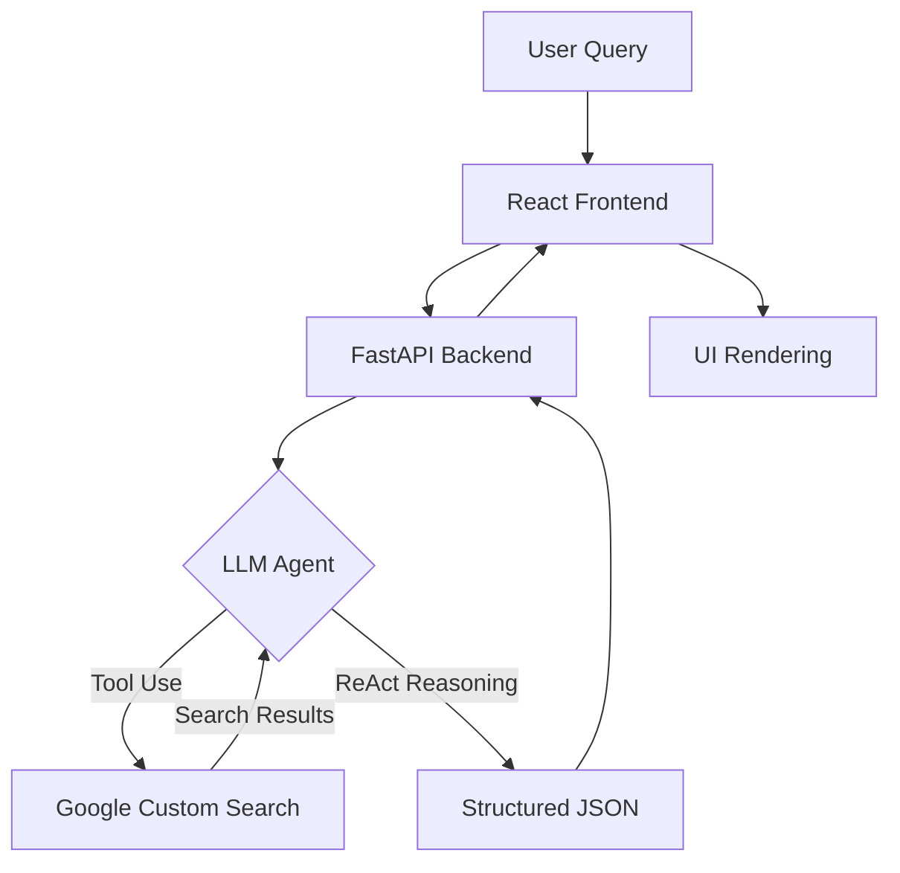

# 🎓 AI Course Finder & Learning Path Recommender

[](https://fastapi.tiangolo.com/)
[](https://reactjs.org/)
[](https://groq.com/)
[](https://ollama.com/)

An intelligent, AI-driven platform that scours the internet to provide high-quality, structured course recommendations and personalized learning paths. By leveraging the speed of **Groq**, the flexibility of **Ollama**, and the precision of **Google Custom Search**, this tool transforms a simple query into a comprehensive educational roadmap.

---

## 🌟 Key Features

- **AI-Powered Discovery**: Uses Large Language Models (LLMs) via Groq or Ollama to identify the best learning resources.
- **Real-Time Web Search**: Integrates with Google Custom Search Engine (CSE) to find current, live courses across the web.
- **Personalized Learning Paths**: Curates step-by-step roadmaps (Beginner → Intermediate → Advanced) tailored to your topic.
- **Smart Filtering**: Advanced server-side and client-side filtering for Level, Price (Free/Paid), Provider, and Duration.
- **Conversational Refinement**: Refine your results using natural language (e.g., *"Show me the cheapest one from Coursera"*).
- **Responsive Design**: A sleek, dark-themed UI built for both desktop and mobile experiences.

---

## 🧠 The Brain: Groq, Ollama & Google Search

This project utilizes a sophisticated **Agentic Architecture** to bridge the gap between static LLM knowledge and the ever-changing web.

### 1. Groq (Cloud LLM)
We use **Groq**'s Llama 3.1-8b-instant model as the primary inference engine. Groq's LPU (Language Processing Unit) architecture allows for near-instantaneous response times, making the "agentic" search feel fluid and fast.

### 2. Ollama (Local Alternative)
The architecture is designed to be compatible with **Ollama**. By changing the base URL and model in the backend configuration, users can run the recommendation agent entirely on their local machine, ensuring privacy and offline capability (for cached searches).

### 3. Google Custom Search (The "Eyes")
Unlike standard ChatGPT or Claude which have a knowledge cutoff, our agent has "eyes" on the live web. It uses the **Google Custom Search API** to fetch real links, descriptions, and metadata from thousands of educational platforms like Coursera, edX, Udemy, and more.

---

## 🏗️ Architecture & Data Flow



---

## 🛠️ Tech Stack

### Frontend
- **Framework**: React 18 with TypeScript
- **Styling**: Tailwind CSS & Lucide Icons
- **State Management**: React Hooks & Context
- **Build Tool**: Vite

### Backend
- **Framework**: FastAPI (Python 3.10+)
- **LLM Orchestration**: LangChain 0.2
- **Agent Framework**: ReAct (Reason + Act) Agent
- **Data Validation**: Pydantic v2

---

## 🚀 Setup & Installation

### Prerequisites
- Python 3.10+
- Node.js 18+ or Bun
- Groq API Key
- Google Cloud API Key & CSE ID

### 1. Backend Configuration
```bash
cd backend
python -m venv venv
source venv/bin/activate  # Or .\venv\Scripts\activate on Windows
pip install -r requirements.txt
```
Create a `.env` file in `/backend`:
```env
GROQ_API_KEY=your_key_here
GOOGLE_API_KEY=your_key_here
GOOGLE_CSE_ID=your_id_here
```
Run the server:
```bash
uvicorn app.main:app --reload
```

### 2. Frontend Configuration
```bash
cd ai-course-finder
npm install # or bun install
npm run dev
```

---

## 🔌 API Endpoints

### `GET /api/recommend`
Fetches structured recommendations based on a topic and optional filters.
- **Params**: `topic` (string), `level`, `pricing`, `provider`, `duration`.

### `POST /api/refine`
Conversational endpoint to narrow down results.
- **Body**: `{ "courses": [...], "query": "Show me the free ones" }`

---

## 📝 License

This project is open-source and available under the MIT License.

---
*Built with ❤️ for lifelong learners.*
